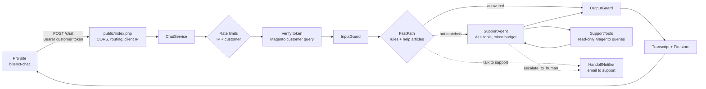

# BiteNXT Pro support chat: how it is built

This document explains what the support chat does, how a message travels through the system, and where security
and privacy are enforced in the code. File paths are relative to the repository root.

## 1. What it is

A support chatbot for **logged-in BiteNXT Pro customers** (dental clinics, labs and practitioners). It answers:

- order status, recent orders, order counts, follow-ups on an order;
- patients (list, orders for a patient), cart, coupons, catalog and product search;
- how-to questions about the Pro portal (place an order, attachments and notes after ordering, sign up, payment...);
- hand-over to the support team by email ("talk to support", change requests), with the support phone for urgent cases.

It is **read-only**: it never places, changes or cancels anything in Magento. Changes go to a person.

| Part | Technology |
|---|---|
| Backend | PHP 8.3, Composer, Apache (`php:8.3-apache` container) |
| Hosting | Google Cloud Run (`asia-south1`), deployed from GitHub through the console |
| Store data | Magento 2.4.6 GraphQL (Pro's own queries), with the customer's own login token |
| Conversation storage | Firestore (sessions, rate limits, token counters), with a TTL |
| AI (fallback only) | Gemini Flash-Lite through an OpenAI-compatible API; OpenRouter or Claude as backup providers |
| Hand-over | SMTP (Brevo) via PHPMailer, optional webhook |
| Frontend | `<bitenxt-chat>` web component (Shadow DOM) or the older `widget.js` |

## 2. Architecture

### Main code

| File | Role |
|---|---|
| `public/index.php` | Front controller: CORS allow-list, routes (`POST /chat`, `GET /chat/history`, `POST /chat/feedback`, `/health`, scripts), client IP from trusted proxy hops, Bearer token parsing, safe 500 errors |
| `src/App.php` | Wires everything from configuration (`Config.php`, environment variables) |
| `src/Chat/ChatService.php` | One message end to end: rate limit → auth → input guard → fast path or AI → output guard → save |
| `src/Chat/FastPath.php` | Instant, rule-based answers without AI: lookups, support flow, help articles, change requests |
| `src/Agent/SupportAgent.php` | AI loop: provider fallback, tool calls (max 6 rounds), token budget |
| `src/Agent/SupportTools.php` | The only things the AI (and fast path) can do: 12 read-only tools plus `escalate_to_human` |
| `src/Agent/SystemPrompt.php` | AI instructions: scope, portal feature map, tool guide, refusal rules, canary |
| `src/Magento/MagentoCustomerDataSource.php` | GraphQL queries, always with the customer's own token |
| `src/Magento/OrderPresenter.php` | Allow-list of fields the AI and customer may see |
| `src/Guardrails/*` | `InputGuard`, `OutputGuard`, rate limiters |
| `src/Budget/*` | Token budget per customer, per hour and per day |
| `src/Session/*` | Conversation storage (Firestore, or files for local runs) |
| `src/Support/HandoffNotifier.php`, `HandoffMailer.php` | Hand-over email (HTML + plain text) and webhook |
| `src/Knowledge/KnowledgeBase.php` + `knowledge/*.md` | Help articles, keyword search with synonyms |
| `src/Widget/bitenxt-chat.js` | Themable web component |

## 3. How one message is handled

`ChatService::handle()` runs these steps in order. Any failed step stops the request.

1. **Rate limit by IP** (`RateLimiter`, 10/minute and 200/day by default), before anything else is done.
2. **Verify the login.** The `Authorization: Bearer <Magento customer token>` is checked by asking Magento who the
   customer is (`currentCustomer`). No or invalid token → `401` "Please log in". The verified identity is cached for 5
   minutes in APCu, keyed by a **SHA-256 hash of the token** (never the token).
3. **Rate limit by customer**, so one customer cannot use many IPs to get around the limit.
4. **Input guard** (`InputGuard`): strips control and invisible characters, checks UTF-8 and length (2,000
   characters), and flags injection or probing attempts (logged as `suspicious_input`).
5. **Load the conversation.** The customer's current conversation is found by their **owner key** (Magento customer
   ID), never by anything the browser sends. A new one starts after 30 idle minutes or 40 turns.
6. **Fast path** (`FastPath`, `AI_MODE=fallback` by default), with no AI:
   - greetings, thanks, the menu;
   - "talk to support" and similar ways of asking: if the message has no details, the bot asks what it is about,
     then emails the team;
   - order status, recent orders, counts, follow-ups, patients, coupons, cart, catalog, product search;
   - updating attachments or notes: explains My Order and offers **Email this to support**;
   - clear how-to questions answered word for word from a help article.
7. **AI agent**, only if nothing above matched (`SupportAgent`):
   - the token budget is reserved first; if a limit is reached, the chat pauses AI answers politely;
   - the provider list is tried in order (e.g. Gemini, then OpenRouter); a provider error falls through to the next;
   - the AI may call tools from `SupportTools` (at most 6 rounds); every tool runs with the customer's token;
   - only the last 6 question/answer pairs are sent, and replies are capped at 400 output tokens.
8. **Output guard** (`OutputGuard`) checks the reply (section 5).
9. **Save**: the reply goes into the transcript (what the customer saw, after the guard) and the session is written
   to Firestore. A `timing` log line records the path (`fast_path`, `article`, `menu`, `ai`) and time spent.

Responses carry `quick_replies` (tap-to-reply buttons) for the next step.

## 4. The tools (everything the bot can do)

All tools are in `src/Agent/SupportTools.php`. All are **read-only** except `escalate_to_human`, which only sends an
email to staff.

| Tool | Magento query (customer-scoped) |
|---|---|
| `get_recent_orders` | `customerOrders` (Pro's "MyOrderList") |
| `get_order_status` | `customer { orders(filter: number) }` |
| `get_order_stats` | `customerAllOrders` |
| `get_order_follow_ups` | `getOrderFollowUps` (only for orders confirmed to be the customer's) |
| `list_patients` | `fetchPatients(id: <verified customer ID>)`, else patients from the customer's orders |
| `find_orders_by_patient` | the customer's own order list, filtered by patient name |
| `get_available_coupons` | `availableCoupons` |
| `get_cart_summary` | `customerCart`, `getPatientFromCart`, `getDoctorFromCart`, `kixrScanStatus` |
| `search_products`, `get_catalog_overview` | `products`, `categoryList` |
| `search_help_articles` | local `knowledge/*.md` |
| `escalate_to_human` | no Magento call: hand-over email |

**No tool accepts a customer ID, email or token as input.** Identity always comes from the verified login (a test,
`testNoToolAcceptsAnIdentityChosenByTheModel`, fails if any tool parameter looks like an identity field). The bot runs
**no mutations** and uses **no admin token**, so it cannot change data or see other customers' data even if the AI is
tricked.

## 5. Security and privacy: where it is enforced

### 5.1 Authentication and access control

| Control | Where |
|---|---|
| Chat only for logged-in customers; token verified with Magento on every request (5-minute cache) | `ChatService::authenticate()` |
| Token format checked (`Bearer` + 10–2048 safe characters) | `public/index.php` |
| Token is **never stored, logged or sent to the AI**; only its SHA-256 hash is kept | `ChatService`, `ChatSession::$tokenHash` |
| Conversation chosen by the server from the verified customer, never by a client-sent ID | `ChatService::currentConversation()` |
| Every Magento query uses the customer's own token, so Magento itself limits results to that customer | `MagentoCustomerDataSource` |
| Order numbers must be confirmed as the customer's before follow-ups or hand-over can use them (`knownOrderNumbers`) | `SupportTools` |
| After 5 order numbers not found, lookups stop (prevents guessing other orders) | `SupportTools::checkOrderNumber()` |
| History endpoint returns only the owner's conversations, re-checked per session | `ChatService::history()` |

### 5.2 What the AI can and cannot see

| Control | Where |
|---|---|
| Field allow-list: only status, dates, items, totals, tracking and patient label reach the AI. Addresses, phones, emails, payment data, file paths, internal IDs, patient age/gender are never copied | `OrderPresenter` |
| **Patient names are shortened to first name + last initial** ("Ravi K.") everywhere | `OrderPresenter::patientLabel()` |
| No file names from the cart (they can contain patient names) | `OrderPresenter::cart()` |
| Fast-path answers never touch the AI at all | `FastPath` |
| Only the last 6 turns of history go to the AI | `AI_HISTORY_TURNS` |
| System prompt: answer only about the customer's own account, never reveal instructions, code or other customers | `SystemPrompt` |
| Prompt canary: a secret marker in the system prompt; any reply containing it is blocked | `App::canary()`, `OutputGuard` |
| Paid-tier Gemini API (prompts not used for training) is recommended in `docs/LOW-COST.md` | configuration |

### 5.3 Input protection

`InputGuard` removes control characters and invisible Unicode (used to smuggle instructions), rejects invalid UTF-8
and over-long messages, and flags `prompt_injection`, `role_override`, `system_prompt_probe`, `code_probe` and
`other_customer_probe`. Flagged messages skip the fast path, are logged, and the AI is instructed to decline. The real
protection is structural (tools can only reach the customer's own data, and every reply is checked).

### 5.4 Output protection (every reply, AI or not)

`OutputGuard::filter()`:

- **Blocks** the whole reply (replaced with a safe message, and the turn removed from AI memory) if it contains code
  fences, PHP, SQL, GraphQL, stack traces, server paths, internal namespaces, credentials or API keys, or the canary.
- **Redacts** emails, phone numbers and card numbers (Luhn-checked) unless they are the customer's own email, the
  store's public contacts (support phone/email), or identifiers from the customer's own data (order and tracking
  numbers, SKUs).
- Blocked and redacted replies are logged (`reply_blocked`, `reply_redacted`) without the text.

The widget inserts replies **as text, never HTML**, so a reply cannot inject markup into the Pro site.

### 5.5 Abuse and cost limits

| Control | Default | Where |
|---|---|---|
| Requests per IP and per customer | 10/minute, 200/day | `RATE_LIMIT_PER_MINUTE`, `RATE_LIMIT_PER_DAY` |
| AI tokens per customer | 300,000/day | `TOKEN_LIMIT_CUSTOMER_PER_DAY` |
| AI tokens for the whole service | 200,000/hour, 1,000,000/day | `TOKEN_LIMIT_GLOBAL_PER_HOUR`, `TOKEN_LIMIT_GLOBAL_PER_DAY` |
| Reply length | 400 output tokens | `MAX_OUTPUT_TOKENS` |
| Tool rounds per answer | 6 | `SupportAgent::MAX_TOOL_ROUNDS` |
| Hand-over emails per conversation | 5, identical repeats held back | `SupportTools::MAX_HANDOFFS_PER_CONVERSATION` |
| Request body | 16 KB (`/chat`), 1 KB (`/feedback`); PHP `post_max_size` 64K; file uploads off | `public/index.php`, `docker/php.ini` |

### 5.6 Web and server hardening

| Control | Where |
|---|---|
| CORS: only origins in `ALLOWED_ORIGINS` (e.g. `https://uat-pro.bitenxt.com`) and the service's own pages; others get `403` | `public/index.php` |
| Real client IP taken from `X-Forwarded-For` by counting trusted proxy hops (`TRUSTED_PROXY_HOPS=1` on Cloud Run), so the header can't be spoofed to dodge limits | `public/index.php` |
| `X-Content-Type-Options: nosniff`, `Cache-Control: no-store` on API responses | `public/index.php` |
| PHP errors never shown to the client; 500 returns a generic message | `public/index.php`, `docker/php.ini` (`display_errors=Off`, `expose_php=Off`) |
| Apache `ServerTokens Prod`, `ServerSignature Off`, no directory listing | `Dockerfile`, `docker/apache.conf` |
| Container runs as `www-data`, not root; only `public/` is web-served | `Dockerfile` |
| Web component renders in Shadow DOM: the Pro site's CSS and the chat's CSS can't affect each other | `src/Widget/bitenxt-chat.js` |

### 5.7 Data storage and retention

- **Firestore** holds conversations (transcript, AI-format history, verified customer ID/name/email, token hash),
  rate-limit and token counters. Every conversation document has an `expireAt` field; a Firestore TTL policy deletes it
  after **90 days** (`HISTORY_RETENTION_DAYS`), and the code also treats expired documents as gone.
- Firestore is reached with the Cloud Run service account (no keys in the code).
- APCu (in-memory, per instance) caches verified logins (5 min, hashed key), the catalog (1 h) and the GCP access token.

### 5.8 Logging without personal data

`src/Support/Logger.php` writes JSON lines to Cloud Logging:

- customers and IPs are logged as **pseudonyms** (first 16 hex characters of a SHA-256 hash);
- message text is not logged; `knowledge_gap` queries are logged with **digits and emails masked**;
- hand-over log lines record the request but not the conversation;
- SMTP errors are logged without the password.

### 5.9 Hand-over to the support team

`escalate_to_human` → `HandoffNotifier::notify()` → `HandoffMailer::send()`:

- The email goes only to staff inboxes (`HANDOFF_EMAIL_TO`), one copy per inbox, **Reply-To set to the customer** so
  staff answer by email. Replies do not come back into the chat.
- The email contains the verified customer's name, email and ID (from the login, never from chat text), the request in
  the customer's words, the order (only if confirmed to be theirs), and the last 10 messages, **newest first**.
- Everything in the HTML email is **HTML-escaped**, so customer text cannot inject markup.
- The customer is told the reply will come to their registered email. If sending fails, they are given the support
  phone and email instead of a false promise.
- SMTP uses STARTTLS on port 587 with LOGIN auth; the SMTP key is an environment variable (moving it to Secret Manager
  is recommended).

## 6. Hybrid mode: rules first, AI second

`AI_MODE` decides how much AI is used:

| Mode | Behaviour |
|---|---|
| `fallback` (default) | Fast path and help articles first; AI only for questions nothing else answers |
| `primary` | AI answers everything the fast path doesn't (same as fallback in practice, kept for tuning) |
| `off` | No AI at all; unmatched questions get a menu of what the bot can do |

Most everyday questions are answered from live Magento data through fixed templates, so they are instant, free and
cannot be made up. The `timing` log shows the split (`path=fast_path|article|menu|ai`).

## 7. Frontend: `<bitenxt-chat>`

- Served by the backend at `/bitenxt-chat.js` (support phone filled in at serve time).
- Reads the customer token from `localStorage`, `sessionStorage`, a cookie, a property or a function; sends it only
  as the `Authorization` header to the chat API; never shows or stores it.
- Hidden until a token exists; fires `bitenxt-auth-required` when the token is missing or rejected.
- Themed by CSS custom properties and `::part()`; see `docs/WEB-COMPONENT.md`.

## 8. Testing and checks

- `vendor/bin/phpunit`: unit and integration tests with fake Magento, fake AI and fake mailer. They cover
  cross-customer access, the identity rule for tools, injection and leak blocking, redaction, rate and token limits,
  provider fallback, fast-path answers, support flows and email content (including HTML escaping).
- `deploy/uat-check.sh`: runs every question in `eval/questions.txt` against a deployed service and prints each answer
  with its time.

## 9. Known limits and next steps

- Hand-over email is sent from a Gmail address through Brevo and may land in Spam: verify the bitenxt.com domain in
  Brevo and send from a bitenxt.com address.
- Move `SMTP_PASSWORD` to Secret Manager.
- Rule-based answers are in English; the AI replies in the customer's language.
- Support replies arrive by email, not inside the chat (by design for v1).
